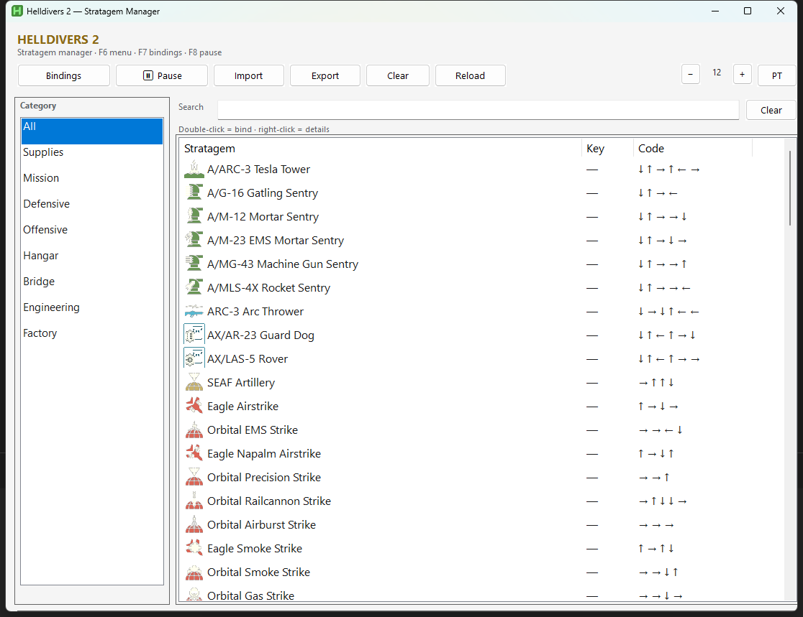
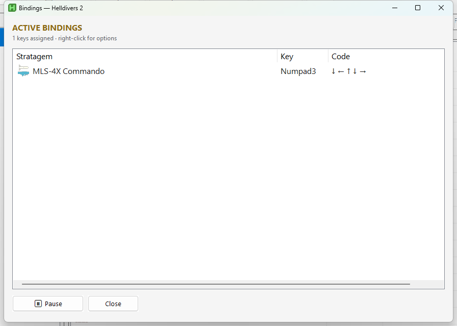

# Helldivers 2 — Stratagem Manager

Visual stratagem manager for **Helldivers 2**: wiki icons, search, categories, numpad hotkeys, and automatic in-game code execution via AutoHotkey v2.

## Screenshots

### Main window



### Bindings



## Features

- **~105 stratagems** synced with [helldivers.wiki.gg](https://helldivers.wiki.gg/wiki/Stratagems)
- **Wiki icons** on every row
- **Category sidebar** (Supplies, Offensive, Hangar, etc.)
- **Search** by PT/EN name and description
- **Numpad binds** (double-click a stratagem → press a key)
- **PT / EN** UI language toggle
- **Adjustable list font size**
- **Import / export** `bindings.ini`
- **Auto-focus** Helldivers 2 before sending inputs (optional)

## Required: in-game control settings

This app sends **keyboard arrow keys** (`↑` `↓` `←` `→`) followed by **Enter** to call stratagems.  
By default, Helldivers 2 uses **WASD** for stratagem input on mouse & keyboard — **the macro will not work until you rebind stratagem directions in the game.**

### What to change in Helldivers 2

1. Open **Options** → **Mouse & Keyboard** → **Change Keybindings**
2. Scroll to the **Stratagem** section
3. Set these four bindings to the **arrow keys** on your keyboard:

   | Stratagem input | Bind to |
   |-----------------|---------|
   | Up              | `↑` (Up Arrow) |
   | Down            | `↓` (Down Arrow) |
   | Left            | `←` (Left Arrow) |
   | Right           | `→` (Right Arrow) |

4. *(Recommended)* Set **Open Stratagem List** to **Press** instead of **Hold** — easier to use alongside movement
5. Apply and save

After this, your numpad hotkeys from this app will match what the game expects.

> **Tip:** Rebinding stratagem input to arrow keys also lets you **move with WASD while entering codes manually** in-game, since movement and stratagem inputs no longer share the same keys.

> **Note:** If you bind stratagem directions to other keys (e.g. numpad, IJKL), you must either change those bindings back to arrow keys or the macro will not register correctly. This tool is built for **Up / Down / Left / Right** arrow keys only.

## Hotkeys (this app)

| Key | Action |
|-----|--------|
| **F6** | Open / focus main menu |
| **F7** | Bindings window |
| **F8** | Pause / resume hotkeys |
| **F12** | Exit |
| **Double-click** | Assign key to stratagem |
| **Right-click** | Details, copy code, remove bind |

## Requirements

- Windows 10/11
- [AutoHotkey v2](https://www.autohotkey.com/) (only if running the `.ahk` source or compiling yourself)
- Helldivers 2 with stratagem directions bound to **arrow keys** (see above)
- Optional: `AutoActivateGame=1` in `config.ini` to focus the game window before each macro

## Installation

### Option A — Executable (recommended)

1. Download **`Helldivers2-Stratagems.zip`** from [Releases](https://github.com/nilmar-ramos/helldivers2-stratagem-manager/releases/latest) or build locally (see below).
2. Extract the full folder (`Helldivers2-Stratagems.exe` + `icons/`).
3. Run the `.exe`. On first launch, `config.ini`, `bindings.ini`, and `stratagems.ini` are created automatically.

### Option B — From source

```powershell
git clone git@github.com:nilmar-ramos/helldivers2-stratagem-manager.git
cd helldivers2-stratagem-manager
# Open HelldiversMenuVisual.ahk with AutoHotkey v2
```

## Usage

1. Configure **arrow keys** for stratagem input in Helldivers 2 (see [Required: in-game control settings](#required-in-game-control-settings)).
2. Open the menu (**F6**).
3. Filter by category or use **Search**.
4. **Double-click** a stratagem and press a **Numpad** key (e.g. `Numpad3`).
5. In-game, press that key to run the arrow sequence + Enter.

Right-click menu: code, category, description, copy code, remove bind.

### Tuning macro timing

In `config.ini`:

```ini
[General]
MacroDelay=300
AutoActivateGame=1
```

Increase `MacroDelay` if inputs are dropped on slower systems or high latency.

## Configuration files

| File | Purpose |
|------|---------|
| `config.ini` | Language, macro delay, font size, auto-focus game |
| `bindings.ini` | Keys → stratagems |
| `stratagems.ini` | Stratagem list and order in the menu |

## Build

```powershell
.\build.ps1
```

Output in `dist/`:

- `Helldivers2-Stratagems.exe`
- `icons/`
- `LEIA-ME.txt`
- `Helldivers2-Stratagems.zip` (project root; also attached to [GitHub Releases](https://github.com/nilmar-ramos/helldivers2-stratagem-manager/releases))

## Project structure

```
HelldiversMenuVisual.ahk   # Main GUI and hotkeys
HelldiversData.ahk         # Stratagem data (codes, icons, i18n)
HelldiversI18n.ahk         # PT/EN translations
HelldiversIcons.ahk        # ImageList and PNG icons
icons/                     # Wiki icon assets
tools/                     # download_icons.py, flatten_icon.py, etc.
```

## Development tools

```powershell
# Download / update wiki icons
python tools/download_icons.py

# Regenerate NameEn fields in HelldiversData.ahk
python tools/gen_i18n_data.py

# Capture README screenshots
powershell -File tools/capture_screenshot.ps1
powershell -File tools/capture_bindings_screenshot.ps1
```

## Credits

- Stratagem data and icons: [Helldivers Wiki](https://helldivers.wiki.gg/wiki/Stratagems)
- Built with [AutoHotkey v2](https://www.autohotkey.com/)

## License

Personal use. Helldivers 2 © Arrowhead Game Studios.
